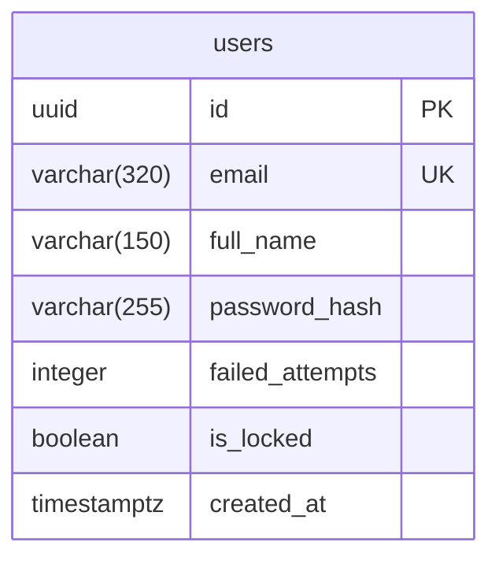

# Database

The application database is **real and live** — PostgreSQL 16, never recreated from a
single monolithic script. Each view contributes its own incremental DDL
(`views/<view>/schema-changes.sql`), written by `requirement-architect` only when that
view actually needs new tables or columns, and only ever additive
(`CREATE TABLE IF NOT EXISTS` / `ALTER TABLE ... ADD COLUMN IF NOT EXISTS`) — never a
destructive `DROP` without the user's explicit confirmation.

This page documents the schema **as it actually exists today**, introspected from the live
database — not what any individual `schema-changes.sql` file proposes in isolation. It's
extended every time a view adds tables or columns; see `lib/agents/doc-reviewer/` for how
that's kept honest.

!!! warning "No automated migration runner yet"
    `tecnologias/tecnologia_bbdd.md` describes a planned `bun run db:setup` script and a
    `schema-bootstrap.ts` helper that would apply every view's accumulated
    `schema-changes.sql` automatically. **Neither exists yet** — today, each view's DDL is
    applied by hand (`psql "$DATABASE_URL" -f views/<view>/schema-changes.sql`, or
    equivalent) as part of building that view. Say so here rather than implying a tool that
    isn't there.

## Extensions

| Extension | Version | Why |
|-----------|---------|-----|
| `pgcrypto` | 1.3 | `gen_random_uuid()` for every table's primary key |

## Conventions

- Primary keys: `UUID PRIMARY KEY DEFAULT gen_random_uuid()`.
- Columns: `snake_case`. No `ENUM` types — closed domains are `CHECK` constraints on
  `VARCHAR`/`INTEGER` instead, by explicit project decision (see `CLAUDE.md`).
- Explicit foreign keys, `ON DELETE` behavior documented in a SQL comment at the point of
  definition.
- Application-level concerns that never touch this schema: user sessions live in an
  in-process `Map` (`InMemorySessionRepository`), never persisted to Postgres — see
  [Architecture](architecture.md) and `tecnologias/tecnologia_bbdd.md`.

## Schema

### `users`

Introduced by the `login` view (`views/login/schema-changes.sql`); `full_name` was added
later by that same view's session-gap reopen, once the Dashboard view needed a display name
to show. Holds one row per teacher — this is a single-tenant-per-row credentials table, not
yet linked to any teaching-content table (ciclos, módulos, años académicos, students, etc.
don't exist yet).

| Column | Type | Constraints | Notes |
|--------|------|-------------|-------|
| `id` | `uuid` | `PRIMARY KEY DEFAULT gen_random_uuid()` | |
| `email` | `varchar(320)` | `NOT NULL UNIQUE` | Login identifier. Never revealed to exist or not in any error response (see `views/login/api-contracts.md`). |
| `full_name` | `varchar(150)` | `NOT NULL` | Display name — e.g. Dashboard's "Bienvenido, `<full_name>`". |
| `password_hash` | `varchar(255)` | `NOT NULL` | `Bun.password.hash` output (argon2id by default) — hashing/verification happen in the application layer, never in SQL. |
| `failed_attempts` | `integer` | `NOT NULL DEFAULT 0` | Consecutive failed login attempts. Reset to `0` on a successful login. |
| `is_locked` | `boolean` | `NOT NULL DEFAULT false` | Set once `failed_attempts` reaches the lockout threshold (`LOCKOUT_THRESHOLD = 5`, see `src/backend/src/repositories/user.repository.ts`). |
| `created_at` | `timestamptz` | `NOT NULL DEFAULT now()` | |

No other tables exist yet. The `configuracion` view currently being planned will add
`ciclos`, `modulos`, `anos_academicos`, and a join table between `anos_academicos` and
`modulos` — this page will grow to document them once that view actually lands, not before.
