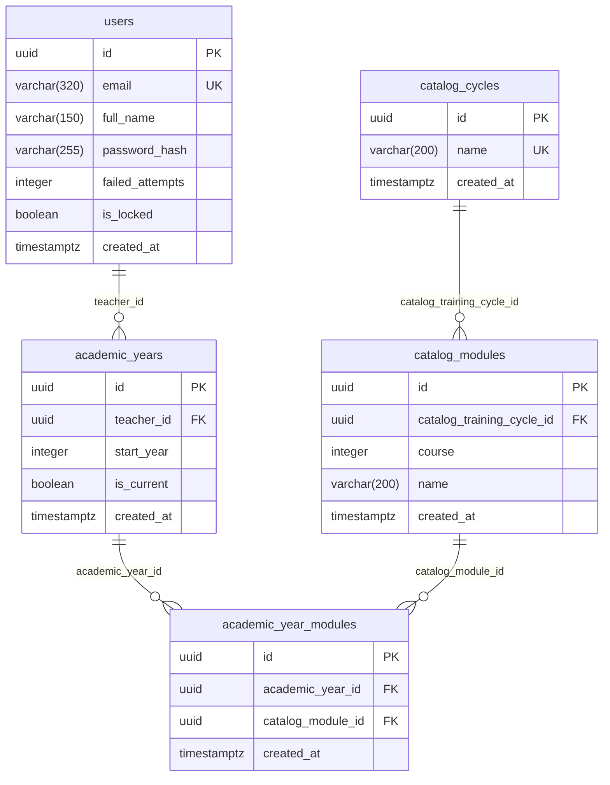

# Database

The application database is **real and live** — PostgreSQL 16, never recreated from a
single monolithic script. Each view contributes its own incremental DDL
(`views/<view>/schema-changes.sql`), written by `requirement-architect` only when that
view actually needs new tables or columns, and only ever additive
(`CREATE TABLE IF NOT EXISTS` / `ALTER TABLE ... ADD COLUMN IF NOT EXISTS`) — never a
destructive `DROP` without the user's explicit confirmation.

This page documents the schema **as it actually exists today**, introspected from the live
database — not what any individual `schema-changes.sql` file proposes in isolation. It's
extended every time a view adds tables or columns; see `lib/agents/doc-reviewer/` for how
that's kept honest.

!!! warning "No automated migration runner yet"
    `tecnologias/tecnologia_bbdd.md` describes a planned `bun run db:setup` script and a
    `schema-bootstrap.ts` helper that would apply every view's accumulated
    `schema-changes.sql` automatically. **Neither exists yet** — today, each view's DDL is
    applied by hand (`psql "$DATABASE_URL" -f views/<view>/schema-changes.sql`, or
    equivalent) as part of building that view. Say so here rather than implying a tool that
    isn't there.

## Extensions

| Extension | Version | Why |
|-----------|---------|-----|
| `pgcrypto` | 1.3 | `gen_random_uuid()` for every table's primary key |

## Conventions

- Primary keys: `UUID PRIMARY KEY DEFAULT gen_random_uuid()`.
- Columns: `snake_case`. No `ENUM` types — closed domains are `CHECK` constraints on
  `VARCHAR`/`INTEGER` instead, by explicit project decision (see `CLAUDE.md`).
- Explicit foreign keys, `ON DELETE` behavior documented in a SQL comment at the point of
  definition. Where a foreign key deliberately has **no** `ON DELETE` cascade, deletion is
  instead blocked at the application level (`409 HAS_DEPENDENTS`) — see
  `academic_year_modules.catalog_module_id` below.
- Application-level concerns that never touch this schema: user sessions live in an
  in-process `Map` (`InMemorySessionRepository`), never persisted to Postgres — see
  [Architecture](architecture.md) and `tecnologias/tecnologia_bbdd.md`.

## Schema

### `users`

Introduced by the `login` view (`views/login/schema-changes.sql`); `full_name` was added
later by that same view's session-gap reopen, once the Dashboard view needed a display name
to show. Holds one row per teacher — the credentials table every other table ultimately
scopes back to (directly, via `academic_years.teacher_id`, or not at all, for the shared
catalog tables).

| Column | Type | Constraints | Notes |
|--------|------|-------------|-------|
| `id` | `uuid` | `PRIMARY KEY DEFAULT gen_random_uuid()` | |
| `email` | `varchar(320)` | `NOT NULL UNIQUE` | Login identifier. Never revealed to exist or not in any error response (see `views/login/api-contracts.md`). |
| `full_name` | `varchar(150)` | `NOT NULL` | Display name — e.g. Dashboard's "Bienvenido, `<full_name>`". |
| `password_hash` | `varchar(255)` | `NOT NULL` | `Bun.password.hash` output (argon2id by default) — hashing/verification happen in the application layer, never in SQL. |
| `failed_attempts` | `integer` | `NOT NULL DEFAULT 0` | Consecutive failed login attempts. Reset to `0` on a successful login. |
| `is_locked` | `boolean` | `NOT NULL DEFAULT false` | Set once `failed_attempts` reaches the lockout threshold (`LOCKOUT_THRESHOLD = 5`, see `src/backend/src/repositories/user.repository.ts`). |
| `created_at` | `timestamptz` | `NOT NULL DEFAULT now()` | |

### `catalog_cycles`

Introduced by the `configuracion` view (Ciclos/Módulos screen, 2026-08-04 redesign). A
**shared, global catalog** — official *ciclos formativos* (training cycles) are the same
for every teacher, so this table is not scoped by `teacher_id` at all.

| Column | Type | Constraints | Notes |
|--------|------|-------------|-------|
| `id` | `uuid` | `PRIMARY KEY DEFAULT gen_random_uuid()` | |
| `name` | `varchar(200)` | `NOT NULL UNIQUE` | e.g. "Desarrollo de Aplicaciones Web". Unique across the whole catalog, not per teacher. |
| `created_at` | `timestamptz` | `NOT NULL DEFAULT now()` | |

Deleting a row cascades to its `catalog_modules` (see below) — **unless** one of those
módulos is still assigned to some academic year, in which case the whole deletion is
blocked with `409 HAS_DEPENDENTS` instead (application-level check, 2026-08-06; see
`catalog_modules` below for why this can't be a DB-level cascade).

### `catalog_modules`

Introduced alongside `catalog_cycles`. One row per módulo profesional within a ciclo,
grouped by `course` (1º/2º).

| Column | Type | Constraints | Notes |
|--------|------|-------------|-------|
| `id` | `uuid` | `PRIMARY KEY DEFAULT gen_random_uuid()` | |
| `catalog_training_cycle_id` | `uuid` | `NOT NULL REFERENCES catalog_cycles(id) ON DELETE CASCADE` | |
| `course` | `integer` | `NOT NULL CHECK (course IN (1, 2))` | 1º or 2º — closed domain via `CHECK`, not an `ENUM`. |
| `name` | `varchar(200)` | `NOT NULL` | Unique together with `(catalog_training_cycle_id, course)`. |
| `created_at` | `timestamptz` | `NOT NULL DEFAULT now()` | |

Deleting a row directly is blocked (`409 HAS_DEPENDENTS`) if it's still referenced by any
`academic_year_modules` row (see that table's `catalog_module_id` column below).

### `academic_years`

Introduced by the `configuracion` view (Año académico screen, real-backend redesign,
2026-08-05). Per-teacher — each teacher's own list of academic years, not shared.

| Column | Type | Constraints | Notes |
|--------|------|-------------|-------|
| `id` | `uuid` | `PRIMARY KEY DEFAULT gen_random_uuid()` | |
| `teacher_id` | `uuid` | `NOT NULL REFERENCES users(id) ON DELETE CASCADE` | Deleting a teacher's account removes their academic years with it. |
| `start_year` | `integer` | `NOT NULL` | Displayed as `"<start_year>-<start_year+1>"`. Unique together with `teacher_id`. |
| `is_current` | `boolean` | `NOT NULL DEFAULT false` | At most one `true` row per teacher, enforced at the application level (`markCurrent` un-marks every other row for that teacher in the same operation) — not a DB constraint. |
| `created_at` | `timestamptz` | `NOT NULL DEFAULT now()` | |

Deleting a row is blocked (`409 HAS_DEPENDENTS`) while it still has `academic_year_modules`
rows — the teacher must un-assign every módulo first.

### `academic_year_modules`

Introduced alongside `academic_years` — the join table between one teacher's academic year
and the shared `catalog_modules` catalog (which cycles/módulos that teacher picked for that
year).

| Column | Type | Constraints | Notes |
|--------|------|-------------|-------|
| `id` | `uuid` | `PRIMARY KEY DEFAULT gen_random_uuid()` | |
| `academic_year_id` | `uuid` | `NOT NULL REFERENCES academic_years(id) ON DELETE CASCADE` | Deleting an academic year removes its módulo assignments with it (only reachable once the application-level `HAS_DEPENDENTS` check above has already been satisfied by the caller un-assigning everything first — this cascade is a safety net, not the primary path). |
| `catalog_module_id` | `uuid` | `NOT NULL REFERENCES catalog_modules(id)` | **No `ON DELETE CASCADE`** — deleting a `catalog_modules`/`catalog_cycles` row while this table still references it is blocked at the application level instead (`409 HAS_DEPENDENTS`, fixed 2026-08-06 after initially shipping with no protection at all, which 500'd on a raw Postgres foreign-key violation — see `catalog_module.service.ts`/`catalog-training-cycle.service.ts`). |
| `created_at` | `timestamptz` | `NOT NULL DEFAULT now()` | |

Unique together with `(academic_year_id, catalog_module_id)` — a módulo can only be
assigned once per academic year; re-assigning an already-assigned one is a silent no-op
(`ON CONFLICT DO NOTHING`), not an error.

No other tables exist yet.
