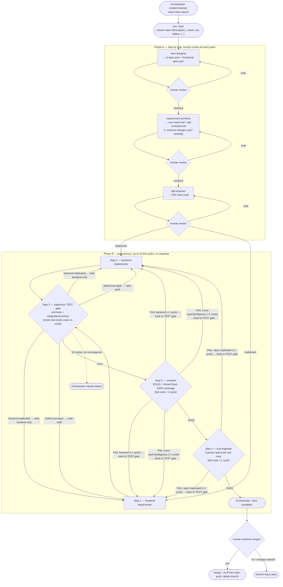

# Pipeline

Every view goes through two phases with opposite control rules, coordinated by the
**Orchestrator** (`/orchestrator`) — in normal use you don't invoke the other agents
directly.

```
Branch — created once, before Phase A starts
  Orchestrator creates/checks out view/<view-name> from main (or resumes it if the view
  was already in progress in a prior session) — every artifact for this view, specs and
  code alike, lives on this branch until it merges

Phase A — step by step, human review required at every point
  you: "read views/<view>/description_<view>.md, tables: [...]"
    → view-designer          → ui-spec.json + functional-spec.json → human review → redo | continue
    → requirement-architect   → use-cases.md + api-contracts.md (+ schema-changes.sql if needed) → human review → redo | continue
    → tdd-engineer            → TDD tests (red) → human review → redo | "implement"

Phase B — autonomous, up to 10 full cycles, no stopping
    → backend-implementer + frontend-implementer (run in parallel)
    → supervisor (per-layer unit tests + integration/contract smoke test between the two)
         Layers implicated: none → reviewer (SOLID + SonarCloud, 100% coverage gate, unified pass)
         Layers implicated: backend|frontend|both/cross-layer → re-dispatch only what's implicated (doesn't consume a cycle) → back to supervisor
    → reviewer
         fail → redo the layer(s) review-report.md implicates (both if cross-layer/ambiguous); cycle += 1; back to supervisor gate
         fail, Layers implicated: requires-tdd-engineer → the one formal exception: re-invoke
              tdd-engineer (adds the missing test, e.g. a fake-sql.ts-backed repository test —
              never rewrites/removes an existing one), no human checkpoint; cycle += 1; back
              to supervisor gate
         pass → e2e-engineer (Cypress, unified pass)
              fail → redo the layer(s) its report implicates (both if ambiguous); cycle += 1; back to supervisor gate
              pass → Orchestrator announces: "view complete"
    → after 10 cycles without converging → Orchestrator reports the failure

Merge — human-gated, single step, fires once right after "view complete"
    → Orchestrator states it's ready to merge view/<view-name> into main and waits
         user confirms → fetch/merge origin/main into the branch first (stop on conflict,
              never auto-resolve) → merge --no-ff into main → push → delete the branch
         user declines or wants changes → branch stays open, no forced timeline
```



There is no visual mockup and no external element numbering. Every element of a view gets
an **`elementId`** (kebab-case string) assigned by `view-designer` — this is the identifier
that runs through the rest of the pipeline:
`ui-spec.json → functional-spec.json → use-cases.md → tests → code`.

## Agents

| Agent | Responsibility | Input | Output |
|-------|-----------------|-------|--------|
| `orchestrator` | Single entry point; decides which agent to run, manages human review (Phase A) and the autonomous loop (Phase B, max. 10 cycles), and owns the view's `view/<view-name>` branch lifecycle (create → carry through A+B → merge to `main` on explicit human confirmation) | User instruction + view state | Notifications to the user at every checkpoint |
| `view-designer` | Designs the UI and behavior of a view from its natural-language description; introspects the real DB if `DATABASE_URL` is configured | `views/<view>/description_<view>.md` | `views/<view>/ui-spec.json` + `views/<view>/functional-spec.json` |
| `requirement-architect` | Use cases + API contracts + incremental schema changes if the view needs them | `ui-spec.json` + `functional-spec.json` | `views/<view>/use-cases.md` + `views/<view>/api-contracts.md` (+ `schema-changes.sql`) |
| `tdd-engineer` | Red unit tests from the acceptance criteria; also a `fake-sql.ts`-backed unit test for any new Postgres repository, and (rarely) re-invoked mid-Phase-B on `reviewer`'s `requires-tdd-engineer` verdict | `use-cases.md` + `api-contracts.md` + `schema-changes.sql` | `src/{backend,frontend}/tests/*.test.ts` (+ `src/backend/tests/helpers/fake-sql.ts`, `pg-<entity>.repository.test.ts`) |
| `backend-implementer` | Backend code only, dispatched as a concurrent subagent alongside `frontend-implementer` during Phase B | Red backend tests + `api-contracts.md` + `schema-changes.sql` | `src/backend/src/` |
| `frontend-implementer` | Frontend code only, dispatched as a concurrent subagent alongside `backend-implementer` during Phase B | Red frontend tests + `ui-spec.json` + `functional-spec.json` + `api-contracts.md` (read-only) | `src/frontend/src/` |
| `supervisor` | Per-layer unit tests + an integration/contract smoke test between backend and frontend, after the parallel implementation step; tells the Orchestrator which layer(s), if any, to re-invoke | `src/backend/tests/` + `src/frontend/tests/` + `api-contracts.md` | `Layers implicated: none\|backend\|frontend\|both\|cross-layer` (report only, no files written) |
| `reviewer` | SOLID + SonarCloud audit (gate: 100% coverage), unified across both layers | Code + tests | `views/<view>/review-report.md` |
| `e2e-engineer` | Cypress tests per use case; also creates whatever runnable-app infrastructure (build, static serving, Cypress config, e2e seed data) is still missing, once, idempotently | `use-cases.md` + specs | `src/frontend/cypress/e2e/*.cy.ts` (+ infra files on first use — see `e2e-engineer.md` Step 0) |
| `ci-setup` *(on-demand)* | GitHub Actions workflows | `CLAUDE.md` + `package.json` | `.github/workflows/*.yml` |
| `doc-reviewer` *(on-demand)* | Audits the consistency of all documentation against the repo's real state | Everything above | Report (no writes) |

Each agent is a role file (`lib/agents/<agent>/<agent>.md`) that Claude Code reads and runs
directly in-session, triggered by its slash command (`.claude/commands/<agent>.md`) or by
the `Skill` tool.

**One exception:** `backend-implementer` and `frontend-implementer` are dispatched as
genuine concurrent subagents (Claude Code's `Agent` tool, two calls in the same message,
using the definitions in `.claude/agents/`) instead of the sequential `Skill`-based route
every other agent in this table uses — the whole point of the split is that the two halves
of a view's code get written at the same time, not one after the other.

## RAG *(planned, not built)*

The Orchestrator and `view-designer` should eventually be able to query a `knowledge_base`
(PostgreSQL + pgvector, embeddings) indexing the view descriptions already written, the
generated artifacts, and the real Postgres schema — to give context across views without
the user having to repeat itself every time. This doesn't exist yet; it will be built as
its own task when it's time.
